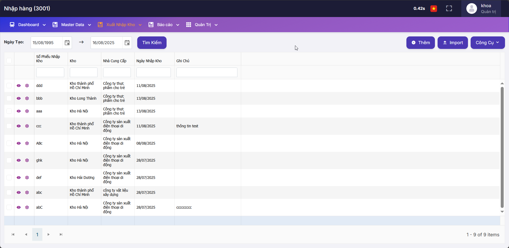
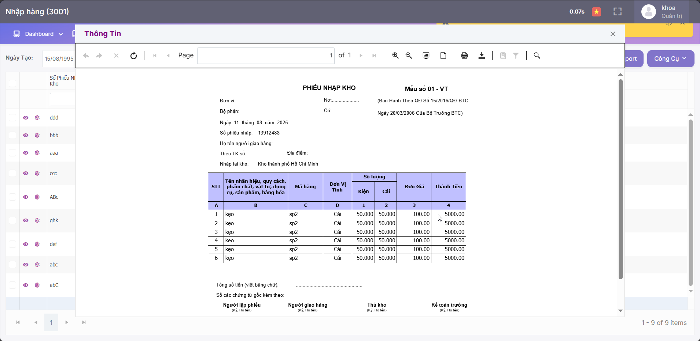
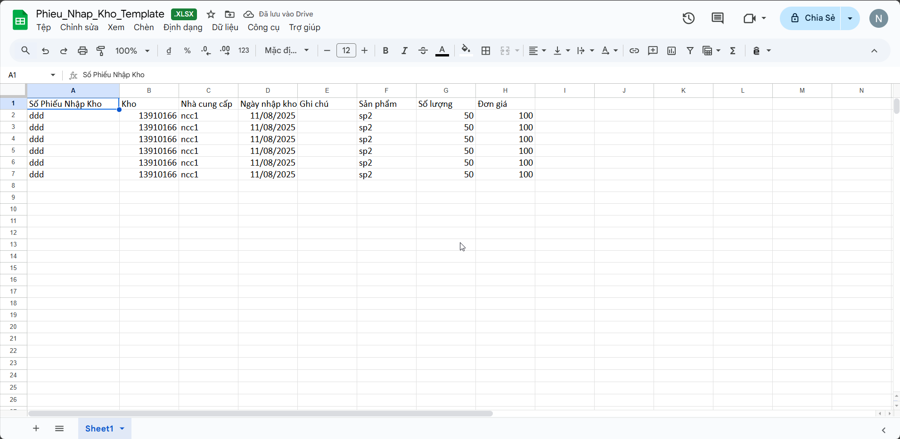

# 📦 TKS_Thuc_Tap_11

## 🇬🇧 **Introduction**
TKS_Thuc_Tap_11 is a **basic-level** warehouse management system, designed for educational and programming practice purposes.  
This project helps students and junior developers understand the warehouse workflow — from goods receiving and dispatching, to stock tracking and reporting.  

While this is a training version, our **advanced warehouse management system** has already been implemented in **over 200 enterprises in Vietnam**, supporting professional and efficient inventory management.  

### 🔹 Key Features
- Product and supplier management  
- Simple reporting & statistics  
- User-friendly web interface  
- User and permission management (members roles & access control)  
- Product and supplier catalog management  
- Warehouse tracking (inventory across locations)  
- Purchase and dispatch slips (goods receiving & issuing)  
- Excel import for bulk data entry (e.g., import goods, inventory, slips)  
- Telerik-powered user interface for main pages and reporting modules  

### 🔹 Tech Stack
- **Backend:** ASP.NET C#  
- **Frontend:** HTML, CSS, JavaScript, TypeScript  
- **Database:** SQL Server  

---

## 🇻🇳 **Giới thiệu**
**TKS_Thuc_Tap_11** là phần mềm quản lý kho ở mức **cơ bản**, phù hợp cho nhu cầu học tập và thực hành để hiểu biết được về các quy trình vận hành kho từ nhập kho, xuất kho, đến thống kê báo cáo.  

Mặc dù đây là **phiên bản thực tập**, nhưng hệ thống quản lý kho ở **mức nâng cao** của phiên bản này đã được triển khai thực tế tại **hơn 100 doanh nghiệp vận hành kho ở Việt Nam**, phục vụ nhu cầu quản lý hàng hóa chuyên nghiệp và hiệu quả.  

### 🔹 Tính năng chính
- Quản lý thành viên và phân quyền người dùng (role-based access control)  
- Quản lý sản phẩm và nhà cung cấp  
- Theo dõi kho hàng (số lượng tồn tại các vị trí)  
- Quản lý phiếu nhập & xuất kho  
- Nhập dữ liệu từ Excel (nhập hàng loạt thông tin sản phẩm, phiếu...)  
- Giao diện chính và báo cáo sử dụng Telerik UI để nâng cao trải nghiệm người dùng  

### 🔹 Công nghệ sử dụng
- **Backend:** ASP.NET C#  
- **Frontend:** HTML, CSS, JavaScript, TypeScript
- **UI & Reporting:** Telerik components   
- **Database:** SQL Server  

## UI/UX page Một số trang giao diện nổi bật

### 🔹 Import page - Trang quản lý phiếu nhập
<p align="center">
  
</p>

### 🔹 Print page - Chức năng in phiếu nhập với telerik
<p align="center">
  
</p>

### 🔹 Templage excel for import - mẫu phiếu nhập kho excel
<p align="center">
  
</p>


## 🛠️ Run Locally / Chạy Local (For Developers)

| 🇬🇧 English | 🇻🇳 Tiếng Việt |
|------------|--------------|
| **Prerequisites**<br>- Windows 10/11<br>- Visual Studio 2022 (ASP.NET workload) or .NET SDK<br>- SQL Server + SSMS<br>- (If used) Telerik UI license key | **Yêu cầu**<br>- Windows 10/11<br>- Visual Studio 2022 (ASP.NET workload) hoặc .NET SDK<br>- SQL Server + SSMS<br>- (Nếu dùng) License key Telerik UI |
| **1) Clone**<br>```bash<br>git clone https://github.com/Khoa-It/TKS_Thuc_Tap_V11.git<br>cd TKS_Thuc_Tap_V11<br>``` | **1) Clone**<br>```bash<br>git clone https://github.com/Khoa-It/TKS_Thuc_Tap_V11.git<br>cd TKS_Thuc_Tap_V11<br>``` |
| **2) Database**<br>- Create DB `TKS_Thuc_Tap_V11` in SQL Server.<br>- Restore schema/seed (if provided) **or** run EF migrations. | **2) Cơ sở dữ liệu**<br>- Tạo DB `TKS_Thuc_Tap_V11` trong SQL Server.<br>- Khôi phục schema/dataset (nếu có) **hoặc** chạy EF migrations. |
| **3) Connection string**<br>- **ASP.NET Core** → `appsettings.json`:<br>```json<br>{ "ConnectionStrings": { "DefaultConnection": "Server=.;Database=TKS_Thuc_Tap_V11;User Id=sa;Password=your_password;TrustServerCertificate=True" } }<br>```<br>- **.NET Framework** → `Web.config`:<br>```xml<br><connectionStrings><add name="DefaultConnection" connectionString="Server=.;Database=TKS_Thuc_Tap_V11;User Id=sa;Password=your_password;TrustServerCertificate=True" providerName="System.Data.SqlClient" /></connectionStrings><br>``` | **3) Chuỗi kết nối**<br>- **ASP.NET Core** → `appsettings.json` (như bên trái).<br>- **.NET Framework** → `Web.config` (như bên trái). |
| **4) Telerik & Uploads (optional)**<br>- Set **Telerik license** key if UI/Reporting is used.<br>- Create folders (e.g. `App_Data/Uploads`, `Reports/Export`).<br>- Ensure write permission for app user. | **4) Telerik & Uploads (tùy chọn)**<br>- Thêm **license** Telerik nếu dùng UI/Reporting.<br>- Tạo thư mục (vd: `App_Data/Uploads`, `Reports/Export`).<br>- Cấp **quyền ghi** cho tài khoản chạy app. |
| **5) EF Migrations (if applicable)**<br>```bash<br>dotnet tool restore || true<br>dotnet ef database update<br>``` | **5) EF Migrations (nếu có)**<br>```bash<br>dotnet tool restore || true<br>dotnet ef database update<br>``` |
| **6) Run**<br>- **Visual Studio:** open `.sln` → Set Startup Project → **F5** (IIS Express).<br>- **CLI (.NET Core):**<br>```bash<br>dotnet restore<br>dotnet build<br>dotnet run<br>``` | **6) Chạy**<br>- **Visual Studio:** mở `.sln` → Set Startup Project → **F5** (IIS Express).<br>- **CLI (.NET Core):**<br>```bash<br>dotnet restore<br>dotnet build<br>dotnet run<br>``` |
| **7) Excel Import (large files)**<br>- Allow bigger uploads:<br>**ASP.NET Core** `appsettings.json`:<br>```json<br>{ "Kestrel": { "Limits": { "MaxRequestBodySize": 104857600 } } }<br>```<br>**Web.config** (.NET Framework):<br>```xml<br><system.web><httpRuntime maxRequestLength="102400" /></system.web><system.webServer><security><requestFiltering><requestLimits maxAllowedContentLength="104857600"/></requestFiltering></security></system.webServer><br>``` | **7) Import Excel (file lớn)**<br>- Tăng giới hạn upload (mẫu cấu hình như bên trái). |
| **Troubleshooting**<br>- DB connection fails → check SQL login/firewall/TCP-IP.<br>- Telerik errors → verify license & referenced packages.<br>- 500 on upload → check folder permissions & upload limits.<br>- Can’t run `dotnet ef` → `dotnet tool install --global dotnet-ef`. | **Lỗi thường gặp**<br>- Kết nối DB fail → kiểm tra login/firewall/TCP-IP.<br>- Lỗi Telerik → kiểm tra license & packages.<br>- 500 khi upload → kiểm tra quyền thư mục & giới hạn upload.<br>- Không chạy được `dotnet ef` → `dotnet tool install --global dotnet-ef`. |


## 🚀 Deployment / Triển khai

| 🇬🇧 English | 🇻🇳 Tiếng Việt |
|------------|--------------|
| **Deployment on IIS (Windows Server)**<br>1. Install **.NET Hosting Bundle** (for ASP.NET Core) or enable **ASP.NET** feature (for .NET Framework).<br>2. Create an **App Pool**:<br> • .NET Core → **No Managed Code**<br> • .NET Framework → **.NET v4.0**<br>3. Publish the project from Visual Studio:<br> • **ASP.NET Core:** Publish → Folder → copy to server.<br> • **.NET Framework:** Publish → File System → copy to server.<br>4. Configure database connection string in `appsettings.json` or `Web.config`.<br>5. Set **Telerik license key** if required.<br>6. Grant IIS user permissions to **Uploads**, **Reports**, or **Temp** folders.<br>7. Recycle App Pool and browse the site. | **Triển khai trên IIS (Windows Server)**<br>1. Cài **.NET Hosting Bundle** (cho ASP.NET Core) hoặc bật tính năng **ASP.NET** (cho .NET Framework).<br>2. Tạo **App Pool**:<br> • .NET Core → **No Managed Code**<br> • .NET Framework → **.NET v4.0**<br>3. Publish từ Visual Studio:<br> • **ASP.NET Core:** Publish → Folder → copy lên server.<br> • **.NET Framework:** Publish → File System → copy lên server.<br>4. Cấu hình chuỗi kết nối CSDL trong `appsettings.json` hoặc `Web.config`.<br>5. Thêm **license key của Telerik** nếu cần.<br>6. Cấp quyền ghi cho tài khoản IIS vào thư mục **Uploads**, **Reports**, hoặc **Temp**.<br>7. Recycle App Pool và truy cập website. |
| **SQL Server considerations**<br>- Enable **TCP/IP** in SQL Server Configuration Manager if accessing remotely.<br>- Use a dedicated SQL login with `db_owner` permission.<br>- Use `TrustServerCertificate=True` or configure TLS certificate. | **Lưu ý về SQL Server**<br>- Bật **TCP/IP** trong SQL Server Configuration Manager nếu truy cập từ xa.<br>- Dùng tài khoản SQL riêng với quyền `db_owner`.<br>- Dùng `TrustServerCertificate=True` hoặc cấu hình chứng chỉ TLS. |
| **Extra Notes**<br>- Ensure folder permissions for Excel import and report exports.<br>- If using Telerik Reporting, verify that report templates are deployed.<br>- Enable logging for easier debugging in production. | **Ghi chú thêm**<br>- Cấp quyền thư mục cho chức năng import Excel và xuất báo cáo.<br>- Nếu dùng Telerik Reporting, đảm bảo template báo cáo đã được deploy.<br>- Bật logging để dễ debug khi chạy thực tế. |

